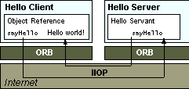
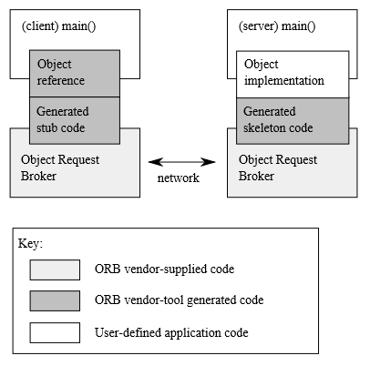

# Java IDL

Java IDL 是一项针对**分布式对象**的技术，所谓分布式对象就是在不同的平台上通过网络进行交互的对象，这个交互的过程称为**[远程过程调用（RPC）](RPC.md)**。Java IDL 类似于 [RMI (Remote Method Invocation)](RMI.md)，即 RPC 的纯 Java 实现，也是一种 RPC 的实现，但也有不同。具体来说，Java IDL 是针对 CORBA（Common Object Request Brokerage Architecture） 的 Java 实现，因为 CORBA 是语言无关的架构，因此 Java IDL 天生可以和其它符合 CORBA 架构的应用交互。

## What Is IDL

IDL（Interface Definition Language），是接口定义语言，用来描述一种通用约定，语言无关。CORBA 就是通过 IDL 来约定接口调用协议，从而做到语言无关，就像 Java 通过 Java IDL 来实现 Java 到 CORBA 的映射，任何语言都可以实现自己到 CORBA 的映射，只要符合 IDL 的规范即可。

IDL 并不是 CORBA 专有的技术，IDL 是一种通用技术，用来描述一种接口的通用约定。

我们来看一个 IDL(someIDL.idl) 实例：

```IDL
module SomeModule{
   interface SomeInterface{
      string someMethod();
   };
};
```

### Mapping IDL to Java

IDL 定义的接口，需要通过 IDL-to-Java compiler 转换成 Java 接口，才能在 Java 环境中运行。执行如下命令：

```
>idlj -fall someIDL.idl
```

就会生成该 IDL 的 Java 对应物，包括客户端和服务端的代码。更多关于该命令的详细信息，请查看命令自带帮助信息。

## CORBA

CORBA 是一种 RPC 协议，也就是分布式对象交互协议。我们来看下 CORBA 的架构图（以下图片来自 [The JavaTM Tutorial](http://www.cs.rtu.lv/PharePub/Java/Tutorial/idl/hello/Default.htm) 和 [Wikipedia](https://en.wikipedia.org/wiki/Common_Object_Request_Broker_Architecture)）：





IIOP 是基于 TCP/IP 的协议，各个 CORBA Provider 通过实现 ORB 来提供对 CORBA 的支持。

### Java Provider

和其它所有 RPC 的实现原理一样，CORBA 也是要处理远程过程的寻址（包括调用方法和参数的网络表示等）、远程过程的实现和绑定以及伺服等功能。

我们先来看客户端（main 方法）：

```Java
ORB orb = ORB.init(new String[] { "-ORBInitialHost", "<host>", "-ORBInitialPort", "<port#>" }, null);

org.omg.CORBA.Object nameServRef = orb.resolve_initial_references("NameService"); // CORBA Naming Service
NamingContext namingContext = NamingContextHelper.narrow(nameServRef);
org.omg.CORBA.Object someRef = namingContext.resolve(new NameComponent[] { new NameComponent("SomeName", "") });
SomeInterface some = SomeInterfaceHelper.narrow(someRef);

some.someMethod(); // return "Some"
```

服务端（main 方法）：

```Java
ORB orb = ORB.init(new String[] { "-ORBInitialPort", "<port#>" }, null);

org.omg.CORBA.Object poaRef = orb.resolve_initial_references("RootPOA"); // An object adapter is the mechanism that connects a request using an object reference with the proper code to service that request. The Portable Object Adapter, or POA, is a particular type of object adapter that is defined by the CORBA specification. The root POA is managed by the ORB and provided to the application using the ORB initialization interface under the initial object name "RootPOA".
POA poa = POAHelper.narrow(poaRef);
poa.the_POAManager().activate();
org.omg.CORBA.Object someRef = poa.servant_to_reference(new SomeInterfaceImpl());
SomeInterface some = SomeInterfaceHelper.narrow(someRef);

org.omg.CORBA.Object nameServRef = orb.resolve_initial_references("NameService"); // CORBA Naming Service
NamingContext namingContext = NamingContextHelper.narrow(nameServRef);
namingContext.rebind(new NameComponent[] { new NameComponent("SomeName", "") }, some);

orb.run();
```

注：更多关于 POA 的信息，请查看 [Portable Object Adapter (POA)](http://docs.oracle.com/javase/7/docs/technotes/guides/idl/POA.html).

服务端真正提供功能的代码：

```Java
public class SomeInterfaceImpl extends SomeInterfacePOA {

    @Override
    public String someMethod() {
        return "Some";
    }

}
```

这里列出来的都是需要手动实现的代码，还有一些通过 IDL-to-Java compiler 生成的代码没有包括进来。所有这些完毕以后，先运行服务端代码，再运行客户端代码，在运行服务端代码之前，需要先启动 ORB：

```batch
>orbd -ORBInitialPort <port#> -ORBInitialHost <host>
```

这样，CORBA 的整个调用过程就完成了。更多细节，请查看文档 [Java IDL: The "Hello World" Example](http://docs.oracle.com/javase/8/docs/technotes/guides/idl/jidlExample.html)。

#### Dynamic Invocation Interface

我们再来回顾一下上述客户端的代码，我们可以看到，其只能应用于固定接口，如果远程过程的接口变了，我们还得生成相应的 Stub，并且修改客户端代码，调用相应的变化之后的接口方法。与之相比，还有种更灵活的方式，即动态调用接口（Dynamic Invocation Interface）。

修改客户端代码：

```Java
ORB orb = ORB.init(new String[] { "-ORBInitialHost", "<host>", "-ORBInitialPort", "<port#>" }, null);

org.omg.CORBA.Object nameServRef = orb.resolve_initial_references("NameService");
NamingContext namingContext = NamingContextHelper.narrow(nameServRef);
org.omg.CORBA.Object someRef = namingContext.resolve(new NameComponent[] { new NameComponent("SomeName", "") });

NVList arguments = orb.create_list(1);
Any any = orb.create_any();
any.insert_string("Some"); // "Some" is argument value.
arguments.add_value("arg", any, org.omg.CORBA.ARG_IN.value); // "arg" is argument name.
any = orb.create_any();
any.insert_string("result");  // "result" can be any text.
NamedValue result = orb.create_named_value("result", any, org.omg.CORBA.ARG_OUT.value); // "result" can be any text.
Request request = someRef._create_request(null, "someMethod", arguments = null, result); // "someMethod" is method name. arguments can be null for no argument.
request.invoke();

request.result().value().extract_string(); // return "Some"
```

注意，动态调用可以完全独立运行，不需要引入 IDL-to-Java compiler 生成的 Stub 等程序。服务端代码不需任何变动，就可以搭配客户端的动态代码运行。和 [RMI](RMI.md) 类似，动态调用也是基于[动态代理](../Languages/DesignPattern/TheProxyPattern.md#动态代理)实现的。

## 最后

我们可以看到，代码非常复杂且不直观，封装的很差劲，这也是为什么 CORBA 没落的原因。即便是 [RMI](RMI.md) 也比 CORBA 清晰易懂。而就 [RPC](RPC.md) 框架来说，我们还有很多选择。

就这样。
