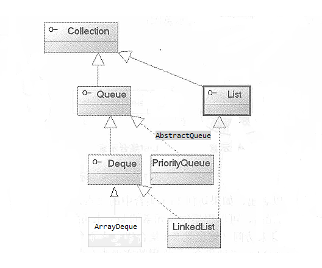
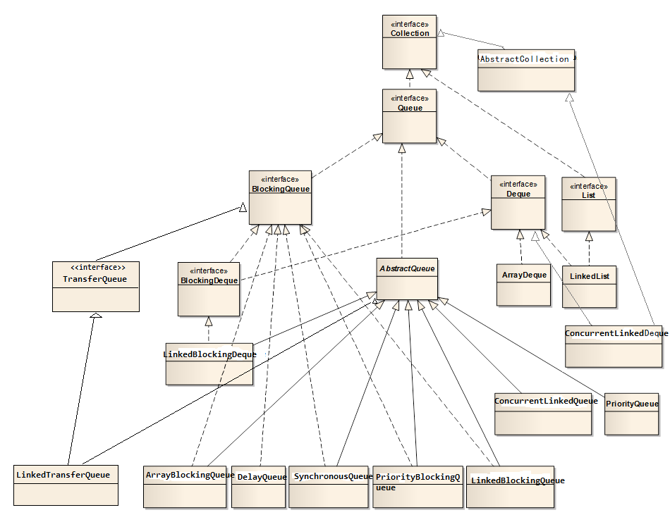

# 集合框架

总体来说，集合类可以分成两类，一类是Collection，一类是Map。我们先来看下整个集合框架的拓扑图：

以及，关于Queue系列的补充图：

**注意**：一般而言，以Tree开头的集合类自动保持元素顺序，通过`compareTo`方法来确定元素顺序，底层二叉树存储；以Priority开头的集合类也是通过`compareTo`方法来确定元素优先级；通过以Linked开头的集合类保持插入顺序，底层链式存储。无序不重集合类是通过`equals`方法来识别元素，如果是基于散列的集合类，首先通过散列值即`hashCode`来判断相等性，再通过`equals`方法进行比较。

## 线程安全的集合类 - #Todo# ConcurrentHashMap, CopyOnWriteArrayList

上面所列出的集合类都是只能工作于单线程环境下，如果在并发环境下，我们需要支持并发的集合类：

## 其它特殊集合类

**受检集合类**

`java.util.Collections` 提供了受检的集合类，即便客户端有意通过原生类型来破坏集合类正常工作，也不会起作用，这些受检集合类可以通过诸如 `checkedSet`、`checkedList`、`checkedMap` 等方法得到。

**只读集合类**

`java.util.Collections` 提供了只读的集合类，即便客户端不被允许修改（添加或删除）该集合类，这些只读集合类可以通过诸如 `unmodifiableSet`、`unmodifiableList`、`unmodifiableMap` 等方法得到。

**线程安全的集合类**

`java.util.Collections` 提供了把既有集合类转成线程安全的集合类的方法，这些线程安全的集合类可以通过诸如 `synchronizedSet`、`synchronizedList`、`synchronizedMap` 等方法得到。

**类型安全的异构容器**

针对集合类泛型化的限制，即只能有固定数目的类型参数，可以通过将类型参数放在键上而不是容器上来避开这一限制，即类型安全的异构容器。[注解](Annotation.md)（Annotation） 提供的很多 API 以及 EnumMap 的定义 `public class EnumMap<K extends Enum<K>, V> extends AbstractMap<K, V>` （EnumMap 就是一个类型安全的异构容器，更多细节，请查看[实例受控类](InstanceControlledClass.md)）就是其应用的实例，更多细节，请另行查看《EJ 2nd Edition》。

## 最后

就这样。
