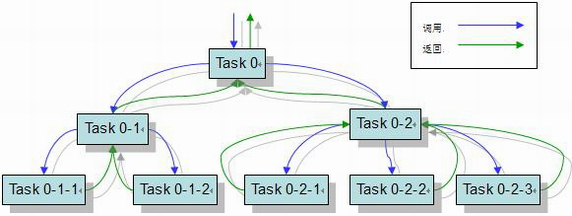
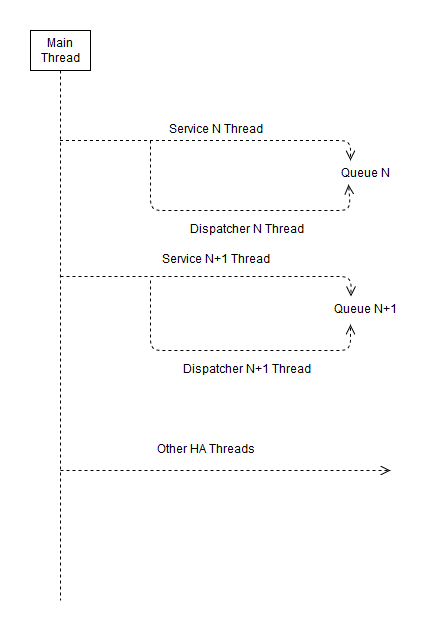
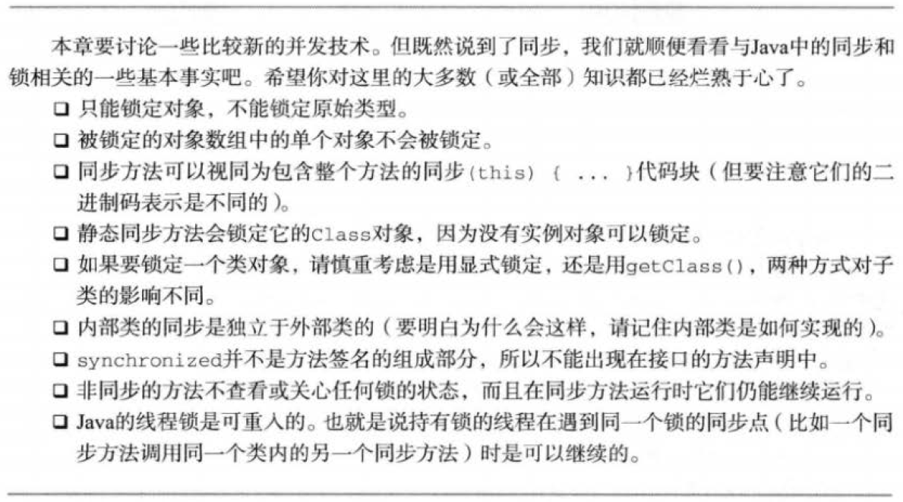
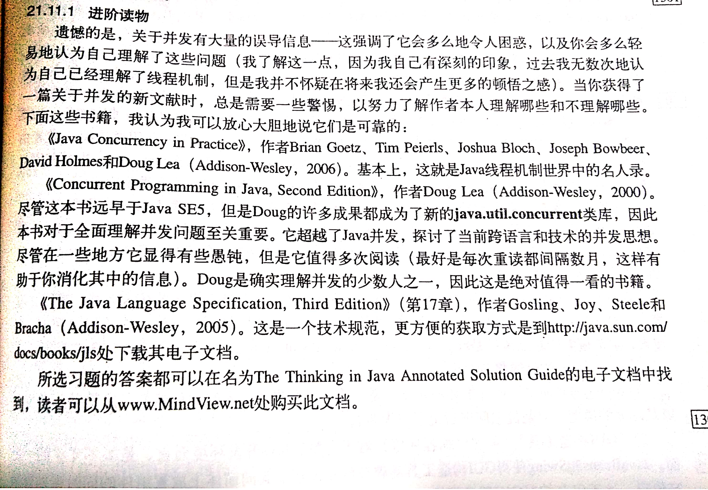

# 并发


Java 的并发模型是基于线程和锁的并发。`java.util.concurrent` 包提供了一套编写并发代码的工具。这个包里有用于执行任务的线程池和在不同线程池之间传递工作的队列，还有并发数据结构，可以用来构建共享缓存，和很多其它底层工具。

## 生命周期

线程的生命周期会经历哪些阶段呢？新建的线程处于 New 状态，启动之后处于 Active(Ready、Running) 状态，执行完毕处于 Terminated 状态。如果线程调用了 `sleep`、`wait` 或者 `join` 方法，则进入 Blocked 状态。如下图所示：

| 线程生命周期 | 线程生命周期  |
| --------   | -----  |
|  |  |

## 启动线程

有多种方法启动线程：

+ 创建继承自 `Thread` 类的实例，然后调用其 `start()` 方法
+ 创建 `Thread` 类的实例，传入实现 `Runnable` 接口的实例，然后调用其 `start()` 方法
+ 创建 `Thread` 类的实例，传入 `FutureTask` 的实例（传入实现 `Callable` 接口的实例），然后调用其 `start()` 方法
+ 通过线程池触发执行：
    + execute：传入实现 `Runnable` 接口的类
    + submit：
        + 传入实现 `Runnable` 接口的类
        + 传入实现 `Callable` 接口的类，返回 `java.util.concurrent.Future` 对象

启动之后，线程的`run()`方法或 `call()`方法会被自动调用，执行逻辑代码，我们不应该显式调用`run()`方法或 `call()`方法。

这里有另外**一个重要的问题**，无论是 `Runnable` 还是 `Callable`，针对启动多个线程的场景，我们应该是创建新的 `Runnable` 或 `Callable` 实例还是复用一个实例？答案是，如果你的 `Runnable` 或 `Callable` 是线程安全的，则可以复用，否则不行，比如，包含状态，且没有进行同步等。

## 等待对象锁暨并发环境的同步问题

多线程环境，同时访问及修改同一个资源就可能造成冲突，不一致，以及所谓的竞态条件（Race Condition），即当两个线程竞争同一资源时，如果对资源的访问顺序敏感，这些时候就需要同步或者加锁。

#### 不可变对象

最简单也是最安全的在并发环境下实现线程安全的方式是不可变对象。更多细节参考[不可变类](ImmutableClass.md)一章。

#### 变量隔离

线程局部变量（ThreadLocal 定义的对象）为每一个使用该变量的线程都提供一个变量值的副本，使每一个线程都可以独立地改变自己的副本，而不会和其它线程的副本冲突。线程局部变量是一种共享变量的线程间的隔离技术。

#### 互斥量式的块同步

`synchronized` 关键字定义的块同步，既可用在方法上，也可以用在匿名代码块上。对于方法而言，这意味着要取得对象实例锁，而对于静态方法而言，则是类锁。对于匿名代码块，则需要显式指明需要取得哪个对象的锁。

除了获得锁的线程能进入该对象之外，其它请求同一个对象的线程都会被挂起，无论请求的是不是同一个方法或同一块代码，这种结构在并发理论中被称为*临界区（Critical Section）*。`synchronized` 可*重入*。

互斥量式的块同步被看作是原始低级的并发编程方式。

#### volatile 域

被 `volatile` 修饰的对象域在每次被线程访问时，都强迫从主内存中重读该成员变量的值；而且当成员变量发生变化时，强迫线程将变化值回写到主内存。这样在任何时刻，两个不同的线程总是看到域的同一个值，也称作*线程可见性*。

Java 语言规范中指出：为了获得最佳速度，允许**线程保存共享成员变量的私有拷贝**，而且只当线程进入或者离开同步代码块时才与共享成员变量的原始值对比。这样当多个线程同时读写某个对象，并且没有进行同步时（不在同步代码快内），就需要让线程及时的得到共享成员变量的变化。而 `volatile` 关键字就是告诉 JVM 对于这个域不能保存它的私有拷贝，而应直接与其它线程共享。

由此可以，使用 `volatile` 屏蔽掉了 JVM 中必要的代码优化，所以在效率上比较低，因此一定在必要时才使用此关键字。

`volatile` 是线程可见的，但不能保证原子性的操作。如下代码可证明：

```Java
public class VolatileIsNotAtomic {

    private volatile int num = 0;

    public void increase() {
        num++;
    }

    public static void main(String[] args) throws InterruptedException {
        VolatileIsNotAtomic ins = new VolatileIsNotAtomic();
        Thread[] threads = new Thread[20];
        Runnable runnable = new Runnable() {
            @Override
            public void run() {
                for (int i = 0; i < 99999; i++) {
                    System.out.println(i);
                    ins.increase();
                }
            }
        };
        for (int i = 0; i < 20; i++) {
            threads[i] = new Thread(runnable);
            threads[i].start();
        }
        for (int i = 0; i < threads.length; i++) {
            threads[i].join();
        }
        System.out.println(ins.num); // 期望 1999980，但可能不是
    }
}
```

#### CAS

CAS 是实现 `j.u.c.atomic.Atomic*` 等原子类型的关键。CAS 全称即 Compare-and-Swap。CAS 的语义是“我认为 V 的值应该为 A，如果是，那么将 V 的值更新为 B，否则修改 A 为 C（假设 V 当前值是 C，即更新我的认识，更新我期望的值为最新），再从头开始判断执行，直到成功”。CAS 是自旋的。CAS 利用底层操作系统级别的指令（JNI 方法）完成原子操作，是非阻塞的，也不需要线程锁。原子类非常适合做计数器（`CountDownLatch` 也可以）或生成序列号。

#### J.U.C 锁

互斥量式的块同步方式，有如下几个缺点：

- 只有一种完全排它类型的锁
- 无法控制阻塞时长
- 阻塞不可被中断

J.U.C 针对性的有一些改进。

**`ReentrantLock`**：**重入锁**，允许尝试性地获取锁，如果得不到不会被阻塞，即 `ReentrantLock(boolean fairLock/*公平锁还是非公平锁*/).tryLock`，一般搭配 `Condition`（条件变量） 使用，值得注意 `ReentrantLock.lock` 方法的效果和互斥量块级锁是一样的，重入锁比较简单，更多用法查看 API 文档。

```Java
private final Lock lock = new ReentrantLock();
private final Condition someCondition = lock.newCondition();

public void someMethod(){
    boolean acquired = false;
    boolean done = false;
    while (!done) {
        ...
        try{
            acquired = lock.tryLock(wait, TimeUnit.MILLISECONDS); // 类似 synchronized() 同步
            if (acquired) {
                if(...){
                    someCondition.await(10, TimeUnit.SECONDS); // 类似 x.wait()
                }
                // do something
            }
        } finally {
            if (acquired) {
                lock.unlock();
            }
        }
        ...
    }
}

public void anotherMethod() {
    ...
    try {
        lock.lock(); // 类似 synchronized() 同步
	      queue.offer(content);
	      someCondition.signal(); // 类似 x.notify()
    }finally {
	      lock.unlock();
    }
    ...
}
```

**`ReentrantReadWriteLock`**：**读写锁**，即 `ReentrantReadWriteLock`，针对向数据结构相对不频繁地写入，但是有多个线程要经常读取这个数据结构的这类情况。读写锁可以允许同时有多个读取者，但如果写锁被其它线程持有，则任何读取者都不能访问（当然写与写之间也是互斥的，即读写互斥，写写互斥，只要有写就是排它的），直到写锁被释放为止，即写的时候不读，一旦不写就有很多线程同时去读（只读，不会从比如队列里移除元素）这种场景。读写锁比较复杂，只有在必要时引入。

上文提到的原子类 `Atomic*` 还允许一种称为**乐观锁**的行为，即我们保持数据为未锁定状态，并“乐观”的认为，在我们修改之前没有被其它线程修改过。乐观锁机制通过 `Atomic*.compareAndSet` 方法提供。

读写锁还是会在读的时候阻塞写线程，戳记锁（`StampedLock`）尝试对读写锁增强，邮戳锁提供了乐观锁机制，还提供了读写锁相互转化的能力。不详细介绍。

另外，还有些关于锁的概念，简单介绍一下，比如自旋锁，自旋锁不会引起调用者睡眠，如果自旋锁已经被别的线程保持，调用者就一直循环在那里看是否该自旋锁的保持者已经释放了锁，“自旋”一词就是由此而来。CAS 执行的时候就是通过自旋方式，直到执行成功。

#### 线程间通信

在  `synchronized` 控制的区域（否则抛出 `java.lang.IllegalMonitorStateException` 异常），我们可以调用`wait()`使一个线程进入等待状态，并释放 ownership of monitor，直到收到其他线程的通知（`notify`、`notifyAll`）或者到了 timeout 时间，该线程恢复执行，除非被中断。

> The current thread must own this object's monitor. The thread releases ownership of this monitor and waits until another thread notifies threads waiting on this object's monitor to wake up either through a call to the notify method or the notifyAll method. The thread then waits until it can re-obtain ownership of the monitor and resumes execution.

除了 `wait/notify` 这种机制，线程之间还可以在同步锁的控制下，通过共享标识符（往往就是一个变量）来达到信息的传递。另外，线程串行化技术、显式地中断线程也都是广义上的线程间通信机制，“传递”某种指令，“感知”某种状态。

如果不是使用 `synchronized` 关键字，而是使用 J.U.C 锁来保证线程间的同步，则和其搭配使用的 `Condition` 可以被用来在线程之间进行协调。

另外，还可以使用队列（一般是阻塞队列），在线程间传递任务或消息。

## 线程串行化

线程是并行执行的，但我们可以通过 `join()` 方法，让线程串行化执行，也就是直到被调用 `join` 方法的线程执行结束，才继续执行当前线程。

另外，`CountDownLatch` 和 `CyclicBarrier` 类也可以达到类似的效果：

```Java
package tech.liujianwei;

import java.util.concurrent.CountDownLatch;

public class CountDownLatchTest implements Runnable {

    private CountDownLatch latch;

    public CountDownLatchTest(CountDownLatch latch) {
        this.latch = latch;
    }

    @Override
    public void run() {
        this.latch.countDown();
        System.out.println(Thread.currentThread().getName() + " executed");
    }

    public static void main(String[] args) throws InterruptedException {
        CountDownLatch latch = new CountDownLatch(3);
        CountDownLatchTest t = new CountDownLatchTest(latch);

        new Thread(t).start();
        new Thread(t).start();
        new Thread(t).start();

        latch.await();
        System.out.println(Thread.currentThread().getName() + " DONE");
    }
}
```

```Java
package tech.liujianwei;

import java.util.concurrent.BrokenBarrierException;
import java.util.concurrent.CyclicBarrier;

public class CyclicBarrierTest implements Runnable {

    private CyclicBarrier barrier;

    public CyclicBarrierTest(CyclicBarrier barrier) {
        this.barrier = barrier;
    }

    @Override
    public void run() {
        System.out.println(Thread.currentThread().getName() + " ready");
        try {
            this.barrier.await();
        } catch (BrokenBarrierException | InterruptedException e) {
            //
        }
        System.out.println(Thread.currentThread().getName() + " executed");
    }

    public static void main(String[] args) throws InterruptedException {
        CyclicBarrier barrier = new CyclicBarrier(3);
        CyclicBarrierTest t = new CyclicBarrierTest(barrier);

        new Thread(t).start();
        new Thread(t).start();
        new Thread(t).start();

        System.out.println(Thread.currentThread().getName() + " DONE");
    }
}
```

## 线程休眠

我们可以调用 `sleep()` 方法来让线程进入休眠状态，除非被中断（`interrupt`），否则直到休眠时间结束，线程继续执行。休眠的线程并不会释放 ownership of monitor。

## 让步执行

有时候我们并不需要线程完全串行（等待某线程执行结束），也不能完全并行执行，而是在有限时间内交替执行，则就会用到 `yield()` 方法。`yield` 的正确意思是让步，被让的线程可能执行也可能没有执行，根据调度让步线程可能仍然接着执行。

## 中断线程

当一个线程调用了可以响应中断的操作的时候，比如 `sleep`、`wait` 及 `join`，可以调用`interrupt()`方法中断该线程的当前状态，抛出 `InterruptedException` 异常，这是唯一从外部**停止**线程的方法。

> Unless the current thread is interrupting itself, which is always permitted, the checkAccess method of this thread is invoked, which may cause a SecurityException to be thrown.

> If this thread is blocked in an invocation of the wait(), wait(long), or wait(long, int) methods of the Object class, or of the join(), join(long), join(long, int), sleep(long), or sleep(long, int), methods of this class, then its interrupt status will be cleared and it will receive an InterruptedException.

> If this thread is blocked in an I/O operation upon an InterruptibleChannel then the channel will be closed, the thread's interrupt status will be set, and the thread will receive a ClosedByInterruptException.

> If this thread is blocked in a Selector then the thread's interrupt status will be set and it will return immediately from the selection operation, possibly with a non-zero value, just as if the selector's wakeup method were invoked.

> If none of the previous conditions hold then this thread's interrupt status will be set.

## 结束线程

有三种方法可以安全的结束一个还在运行的线程：

+ `run()` 方法执行完毕，自动结束。
+ 通过标识符（在 `run()` 的外面设定标识符，在 `run()` 的里面判断标识符）来指定线程结束，适用于循环执行某一操作的线程。
+ 通过 `interrupt()` 方法中断正在执行的线程，捕获该异常并退出，适用于所有线程。

## 后台线程

Java中存在两种线程：用户（user-thread）线程和后台（Daemon）线程，后台线程也叫守护线程。所谓的后台线程，是指用户程序在运行的时候后台提供的一种通用服务的线程，JVM 的垃圾回收线程就是典型的后台线程。这类线程并不是用户线程不可或缺的部分，只是用于提供服务的**服务线程**。我们来看JDK官方文档有关的说明：

> When a Java Virtual Machine starts up, there is usually a single non-daemon thread (which typically calls the method named main of some designated class). The Java Virtual Machine continues to execute threads until either of the following occurs:

> + The exit method of class Runtime has been called and the security manager has permitted the exit operation to take place.
> + All threads that are not daemon threads have died, either by returning from the call to the run method or by throwing an exception that propagates beyond the run method.

那么如何设置一个线程是守护线程呢？线程本身的`setDaemon(boolean)`方法可以设置该线程为守护线程还是用户线程。当所有的在运行的线程都是守护线程的时候，JVM就会退出。

## 线程控制

线程管理的终极目标是不用为调度每个任务或工作单元而启动新线程。`Callable` 就是一个可重复调用的接口，一般提交 `Callable` 会返回一个实现 `Future` 接口的对象。`Future` 接口用来表示还没有完成的异步任务给出的未来结果，可以通过 `Future` 的 `get()`、`cacnel()`、`isDone()` 等方法来管理正在执行的 `Callable` 任务。

需要说明的是，一个 `Callable` 实例，可以通过 `FutureTask` 转化成可以提供给 `Thread` 执行的实例。

```Java
new Thread(new FutureTask<>(new Callable<String>() {
    @Override
    public String call() throws Exception {
    // do some things
        return "some thing";
    }
})).start();
```

STPE(ScheduledThreadPoolExecutor) 是线程池的核心。STPE 接收任务，并把它们安排给线程池里的线程。J.U.C 结合线程池是大中型多线程应用程序最常见的模式之一。

### 线程池

线程也有“池”技术，其实任何一般性的资源敏感的对象都可以“池”化。具体来说，线程池的好处是：

1. 重用存在的线程，减少对象创建、消亡的开销，性能更佳。
2. 可有效控制最大并发线程数，提高系统资源的使用率，同时避免过多资源竞争，避免堵塞。
3. 提供定时执行，定期执行，单线程，并发数控制等功能。

线程池有如下几个重要概念：

- **corePoolSize**：线程池维护的核心线程数。在创建了线程池后，默认情况下，线程池中并没有任何线程，而是等待有任务到来才创建线程去执行任务。等按照需要创建了 corePoolSize 个线程之后，这些数量的线程即使闲置，也不会被线程池收回。这时就是线程池维护的最小线程数了。当线程池中的线程数目达到 corePoolSize 后，就会把到达的任务放到缓存队列当中。corePoolSize 针对 FixedThreadPool、ScheduledThreadPool 有意义。
- **maximumPoolSize**：线程池维护的最大线程数，它表示在线程池中最多能创建多少个线程。
- **keepAliveTime**：当线程池中的线程数量大于 corePoolSize，多出那部分数量的线程空闲 keepAliveTime 后会被收回。
- **unit**：参数keepAliveTime的时间单位
- **workQueue**：一个阻塞队列，用来缓存等待执行的任务
- **threadFactory**：线程工厂，主要用来创建线程。
- **handler**：表示当拒绝处理任务时的策略，有以下四种取值：
    - ThreadPoolExecutor.AbortPolicy:丢弃任务并抛出RejectedExecutionException异常。
    - ThreadPoolExecutor.DiscardPolicy：也是丢弃任务，但是不抛出异常。
    - ThreadPoolExecutor.DiscardOldestPolicy：丢弃队列最前面的任务，然后重新尝试执行任务（重复此过程）
    - ThreadPoolExecutor.CallerRunsPolicy：由调用线程处理该任务

Java 原生支持线程池技术。我们可以用 `java.util.concurrent.Executors` 创建不同类型的线程池。详情查看 API 文档。

## 并发开销

并发系统的开销主要来自于：

- 锁与监控
- 执行环境上下文的切换次数
- 线程的个数
- 调度
- 内存的局部性
- 算法设计

在编写并发代码时，应该确保这些项都考虑过了。

## Fork/Join

Fork/Join（分支/合并）框架完全是为了实现线程池中任务的自动调度，并且这种调度对用户来说是透明的。这就需要把一个任务拆分为多个子任务，每个子任务分别执行，最后合并每个子任务的结果就是最终结果。

Fork/Join 框架的核心就是 `ForkJoinPool` 和 `ForkJoinTask` 两个概念，ForkJoinPool 负责执行比线程“更小”的并发单元 ForkJoinTask。ForkJoinTask 可以拆分成更小的子任务，分别执行最后汇总结果。如下图示：



Java [文档](http://docs.oracle.com/javase/tutorial/essential/concurrency/forkjoin.html)给我们总结了一个代码模板：

```Java
if (my portion of the work is small enough)
    do the work directly
else
    split my work into two pieces
    invoke the two pieces and wait for the results
```

我们可以套用这个模板来构造自己的代码。我们以求和计算为例，代码如下：

```Java
ForkJoinPool pool = new ForkJoinPool(Runtime.getRuntime().availableProcessors()); // ForkJoinPool.commonPool();
pool.invoke(new SumTask(0, 10000));

// shutdown pool
pool.shutdown();
pool.awaitTermination(100, TimeUnit.SECONDS);
pool.isTerminated();
//pool().awaitQuiescence(100, TimeUnit.SECONDS);
```

```Java
public class SumTask extends RecursiveTask<Integer> { // 如果不需要返回值，则可以用 RecursiveAction。

    private static final int THRESHOLD = 100;

    private int start;
    private int end;

    public SumTask(int start, int end) {
        this.start = start;
        this.end = end;
    }

    @Override
    protected Integer compute() {
        int sum = 0;
        if ((end - start) < THRESHOLD) {
            for (int i = start; i <= end; i++) {
                sum += i;
            }
        } else {
            int middle = (start + end) / 2;
            SomeTask left = new SumTask(start, middle); // 拆分成子任务
            SomeTask right = new SumTask(middle + 1, end); // 拆分成子任务
            left.fork(); // 执行子任务
            right.fork(); // 执行子任务，可以用 invokeAll(left, right) 代替
            sum = left.join() + right.join(); // 等待子任务执行完毕，计算结果并返回；如果不需要返回值则可以不等待。
        }
        return sum;
    }

}
```

**注意**：目录 {JAVA_HOME}/sample/forkjoin 包含了 Fork/Join 框架的演示程序。

最后，再来回顾一下什么样的任务适合用 Fork/Join 模式处理。可以总结出：

1. 首先要能拆分成更小的子任务的那些任务
2. 其次子任务之间没有依赖
3. 再者子任务不会对数据进行修改，只是处理并得出结果

你会发现，这些要求和什么很像？没错，MapReduce 模式。凡是适合 MapReduce 的数据集也适合 Fork/Join 框架。

### 附录

#### 一些例子

一个通过非线程安全的队列，实现的生产者-消费者模式：

```Java
package tech.liujianwei;

import java.util.LinkedList;
import java.util.Queue;
import java.util.concurrent.TimeUnit;

public class MyQueue<E> {
    private Queue<E> queue;

    public MyQueue() {
        this.queue = new LinkedList<E>();
    }

    public void offer(E e) {
        synchronized (queue) {
            this.queue.offer(e);
            this.queue.notify();
        }
    }

    public E poll() {
        synchronized (queue) {
            if (this.queue.isEmpty()) {
                try {
                    System.out.println(Thread.currentThread().getName() + ": waiting for new element...");
                    queue.wait();
                } catch (InterruptedException e) {
                    //
                }
            }
            E element = this.queue.poll();
            System.out.println(Thread.currentThread().getName() + ": got new element " + element);
            return element;
        }
    }

    public static void main(String[] args) {
        MyQueue<String> q = new MyQueue();
        new Thread(() -> {
            while (true) {
                q.poll();
            }
        }).start();

        new Thread(() -> {
            while (true) {
                q.poll();
            }
        }).start();

        new Thread(() -> {
            while (true) {
                q.offer("TA" + System.currentTimeMillis());
                try{TimeUnit.SECONDS.sleep(1);}catch (InterruptedException e){}
            }
        }).start();

        new Thread(() -> {
            while (true) {
                q.offer("TB" + System.currentTimeMillis());
                try{TimeUnit.SECONDS.sleep(1);}catch (InterruptedException e){}
            }
        }).start();
    }
}
```

```Java
package tech.liujianwei;

import tech.liujianwei.MarketDataService;

import java.util.LinkedList;
import java.util.Queue;

public class QueueWorker implements Runnable {

    private MarketDataService service;
    private boolean stopped = false;
    private Queue<byte[]> queue;

    public QueueWorker(MarketDataService service) {
        super();
        this.service = service;
        this.queue = new LinkedList<byte[]>();
    }

    public void run() {
        byte[] content = null;
        while (!stopped) {
            while (content == null) {
                synchronized (queue) {
                    if (queue.isEmpty()) {
                        try {
                            queue.wait(500);
                            if(!queue.isEmpty()) {
                                content = queue.poll();
                            }
                        } catch (InterruptedException e) {
                            continue;
                        }
                    }
                }
            }
            service.parseData(content);
            content = null;
        }
    }

    public void addAndNotify(byte[] content) {
        synchronized (queue) {
            queue.offer(content);
            queue.notify();
        }
    }

    public boolean isStopped() {
        return stopped;
    }

    public void setStopped(boolean stopped) {
        this.stopped = stopped;
    }
}
```

一个通过线程安全的队列，实现的生产者-消费者模式：

```Java
package tech.liujianwei.client;

import org.apache.mina.common.IoSession;
import org.apache.mina.handler.demux.MessageHandler;
import tech.liujianwei.model.PlzHpMsg;
import tech.liujianwei.model.AbstractPlzMsg;
import tech.liujianwei.client.processors.PlzMsgHpProcessor;

import java.util.concurrent.ArrayBlockingQueue;
import java.util.concurrent.TimeUnit;

public class PlzMessageHandler implements MessageHandler<AbstractPlzMsg> {

    private ArrayBlockingQueue<AbstractPlzMsg> queue;
    private MessageDispatcher dispatcher;
    private volatile boolean stopped = false;

    public PlzMessageHandler() {
        dispatcher = new MessageDispatcher();
        queue = new ArrayBlockingQueue<>(2000);
    }

    @Override
    public void messageReceived(IoSession ioSession, AbstractPlzMsg plzMessage) {
        try {
            if (stopped) {
                return;
            }
            queue.offer(plzMessage, 50L, TimeUnit.MILLISECONDS);
        } catch (Exception e) {
            //
        }
    }

    private void messageDispatched(AbstractPlzMsg message) {
        if (message instanceof PlzHpMsg) {
            new PlzMsgHpProcessor().process(message);
        } else {
            //
        }
    }

    private class MessageDispatcher extends Thread {
        private AbstractPlzMsg message;

        @Override
        public void run() {
            while (!stopped && !isInterrupted()) {
                try {
                    while ((message = queue.poll(50L, TimeUnit.MILLISECONDS)) == null) {
                        if (stopped) {
                            return;
                        }
                    }
                    messageDispatched(message);
                } catch (InterruptedException e) {
                    break;
                }
            }
        }
    }

    public void start() {
        dispatcher.start();
        stopped = false;
    }

    public void stop() {
        try {
            stopped = true;
            dispatcher.join();
        } catch (Exception e) {
            //
        }
    }
}
```

两个使用 `SynchronousQueue` 的例子，JDK里 `Executors.newCachedThreadPool` 就是用的 `SynchronousQueue`：

```Java
BlockingQueue<String> q = new SynchronousQueue();
new Thread(() -> {
	try {
		String s = q.poll(60L, TimeUnit.SECONDS); // Keep alive 60 sec
		System.out.println(s);
	} catch (Exception e) {
	}
}).start();
new Thread(() -> {
	try {
		boolean r = q.offer("Data" + System.currentTimeMillis(), 60L, TimeUnit.SECONDS); // Keep alive 60 sec
		System.out.println(r);
	} catch (Exception e) {
	}
}).start();
```

```Java
BlockingQueue<String> q = new SynchronousQueue();
new Thread(() -> {
	try {
		String s = q.take();
		System.out.println(s);
	} catch (Exception e) {
	}
}).start();
new Thread(() -> {
	try {
		q.put("Data" + System.currentTimeMillis());
	} catch (Exception e) {
	}
}).start();
```

上述项目的线程模型，用图表示出来就是这样：



#### 一些知识点



| 事件         | 释放对象锁   |  释放 CPU 资源  |
| --------   | -----  | ----  |
| sleep     | No |   Yes    |
| yield        |   No   |   Yes(If accepted)   |
| wait        |    Yes    |  Yes  |
| Condition.await        |    Yes    |  Yes  |
| join        |    No    |  Yes  |
| IO        |    No    |  Yes  |
| Selector.wakeup        |    ?    |  ?  |
| 线程退出        |    Yes    |  Yes  |

#### 推荐书籍


