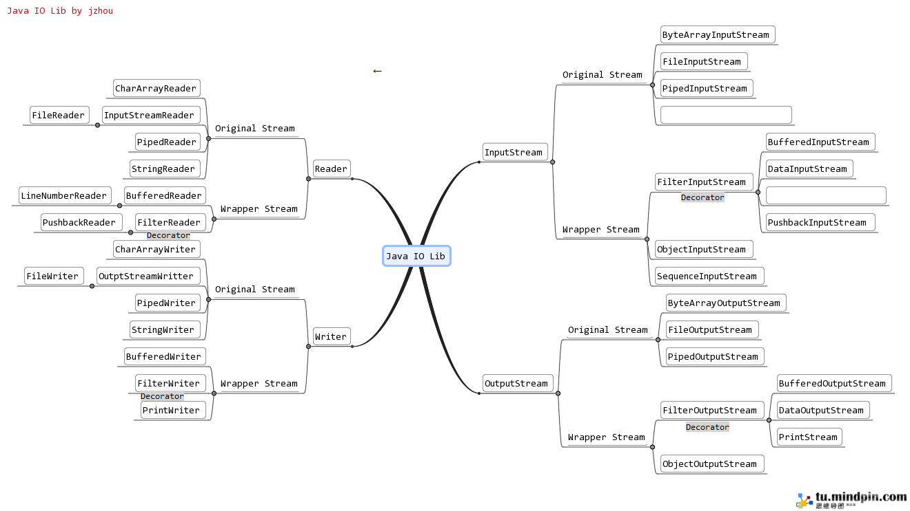

# IO

## IO

我们通过一张图来看下整个 IO 框架的结构：



值得注意的是，在相同操作下，原生的读写流性能非常差，比如 FileInputStream，FileOutputStream 等，而 BufferedInputStream 由于对流进行了缓冲处理，其相当于普通读写流一次读写大块数据，所以极大地提高了性能。但即便如此，仍然不敌接下来介绍的 New IO，所以编程过程中凡是涉及 IO 操作，应尽量使用 New IO 来代替上述这些传统 IO 接口。

## New IO

New IO （以下简称 NIO）是 java.nio 包中一些用于 IO 操作的类和接口。其原理是通过使用更接近操作系统执行 IO 的方式：**通道**和**缓冲器**，从而提高了执行速度。一言以蔽之，**NIO 的目标就是快速移动大量数据**，而且数据量越大优势越明显。

NIO 有下面几个抽象：

+ **Buffer** - A container for data of a specific primitive type.
+ **Channel** - A nexus for I/O operations. A channel represents an open connection to an entity such as a hardware device, a file, a network socket, or a program component that is capable of performing one or more distinct I/O operations, for example reading or writing.

每个基本类型（除了 boolean）都对应一个 Buffer 的实现类，分别操作各自类型的数据。针对文件系统（网络稍后再说），Channel 的一个实现是 `FileChannel`。只有 `ByteBuffer` 可以和 Chanel 交互。可以通过 FileInputStream，FileOutputStream  以及 RandomAccessFile 获得 FileChannel。

**内存映射文件**

另外，FileChannel 可以把其所代表的文件的部分或全部（最大可达2GB）区域映射到内存，称为内存映射文件，这样就允许我们创建和修改那些因为太大而不能整个放入内存的文件。有了内存映射文件，我们就相当于操作的是整个文件一样，其底层实现通过数据的**交换**确保不会发生内存溢出。我们还可以为要操作的文件区域（FileChannel 提供的方法）加锁，确保数据读写不会冲突。如下示例代码：

```Java
MappedByteBuffer buffer = new RandomAccessFile(new File("pathTo/file"), "rw").getChannel().map(FileChannel.MapMode.READ_WRITE, 0, 999_999_999); // buffer 有 get 和 set 方法，供读写用。
```

**注意**：映射文件的输出必须使用`RandomAccessFile`类，虽然`FileOutputStream`也是输出流；输入则可以是 RandomAccessFile 或者 FileInputStream。

**Asynchronous IO**

在 NIO 的基础上，JDK 7 加入了异步 IO 操作。和传统 IO 相比，异步 IO 在读写时，客户端不会阻塞，而是继续往下执行。如下示例代码：

```Java
try (AsynchronousFileChannel channel = AsynchronousFileChannel.open(Paths.get("pathTo/file"));) { // 凡是实现了 AutoCloseable 接口的资源会自动关闭并释放。

    Future<Integer> future = channel.read(ByteBuffer.allocate(900_000_000), 0); // 这里不会阻塞，而是继续执行下去。

    while (!future.isDone()) {
        // do some things else.
    }

    future.get();

} catch (IOException | InterruptedException | ExecutionException e) {
    e.printStackTrace();
}
```

**NIO File**

Java 7 加入了 java.nio.file 包，以及相关的 java.nio.file.attribute 包，提供对文件系统的全面支持，比如文件复制，创建符号链接以及文件属等。如下示例代码：

```Java
Files.copy(Paths.get("pathTo/file"), Paths.get("path"));
```

```Java
Files.createSymbolicLink(Paths.get("pathTo/symbolicLink"), Paths.get("pathTo/file")); // The FileAttributes vararg enables you to specify initial file attributes that are set atomically when the link is created. However, this argument is intended for future use and is not currently implemented.
```

```Java
BasicFileAttributes attributes = Files.readAttributes(Paths.get("pathTo/file"), BasicFileAttributes.class);
FileTime fileTime = attributes.lastModifiedTime();

Map<String, Object> attributes = Files.readAttributes(Paths.get("pathTo/file"), "basic:lastModifiedTime,size"); // 可以用 * 来表示所有 basic-file-attributes.
FileTime fileTime = (FileTime) attributes.get("lastModifiedTime");

FileTime fileTime = (FileTime) Files.getAttribute(Paths.get("pathTo/file"), "basic:lastModifiedTime");

Files.setAttribute(path, "basic:lastModifiedTime", FileTime.fromMillis(System.currentTimeMillis())); // 其它属性包括 basic:creationTime，basic:lastAccessTime，basic:lastModifiedTime，basic:isSymbolicLink，basic:isDirectory，basic:isRegularFile，basic:size，dos:hidden 等；另外，Java 还提供了更直接的设置属性的方法，比如 setLastModifiedTime(Path path, FileTime time) 等。
```

另外，Java 7 还加入了对文件操作的事件的监听机制：

```Java
WatchService watchService = FileSystems.getDefault().newWatchService();
Paths.get("pathTo/file").register(watchService, StandardWatchEventKinds.ENTRY_CREATE, StandardWatchEventKinds.ENTRY_DELETE, StandardWatchEventKinds.ENTRY_MODIFY);

while (true) {
    WatchKey key = watchService.take();
    for (WatchEvent<?> event : key.pollEvents()) {
        // do something using event
    }
    if (!key.reset()) {
        break;
    }
}
```

更多用法和细节，请看官方文档 [File I/O (featuring NIO.2)](http://download.oracle.com/javase/tutorial/essential/io/fileio.html)。

**注意**：目录 {JAVA_HOME}/sample/nio/chatserver 下面包含使用 java.nio.file 包的演示程序，{JAVA_HOME}/demo/nio/zipfs 包含 NIO.2 NFS 文件系统的演示程序。

## File System

什么是文件系统？我们来看下 Java 文档的定义：

>  A file system is essentially a container with organized, homogenous elements referred to as file system objects. A file system provides access to file system objects. A file system object can be a file store, file, or directory. A file store is a volume or partition in which files are stored.

NIO.2 提供了 `java.nio.file.spi.FileSystemProvider` 抽象类，允许我们实现一个自己的文件系统。更多细节，请查看[这里](http://docs.oracle.com/javase/7/docs/technotes/guides/io/fsp/filesystemprovider.html)。

### Path

```
return new Configuration().configure(new File(Hibernate.class.getClassLoader().getResource("hibernate.cfg.xml").getFile())).buildSessionFactory();
//System.out.println(Hibernate.class.getResource("hibernate.cfg.xml"));
//System.out.println(Hibernate.class.getClassLoader().getResource("hibernate.cfg.xml"));
//System.out.println(getClass().getClassLoader().getResource("hibernate.cfg.xml"));
// new File("hibernate.cfg.xml");
```

## Network IO

Java 用于文件 IO 操作的 API，同时也用于网络资源 IO 操作，这就使得操作网络资源如同本地文件一样，简化了编程。

MINA 和 Netty 都是基于 NIO 的构建网络应用的框架。**要去阅读 Netty 的源码。**

http://ifeve.com/
http://blog.chinaunix.net/uid-24186189-id-2623973.html
